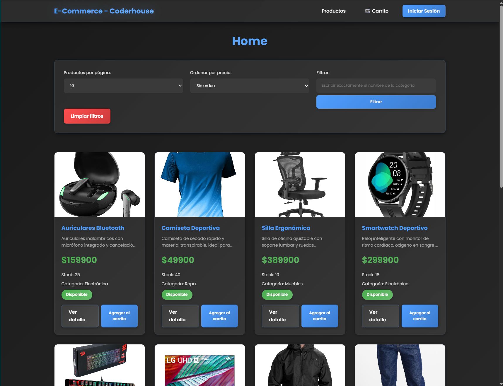
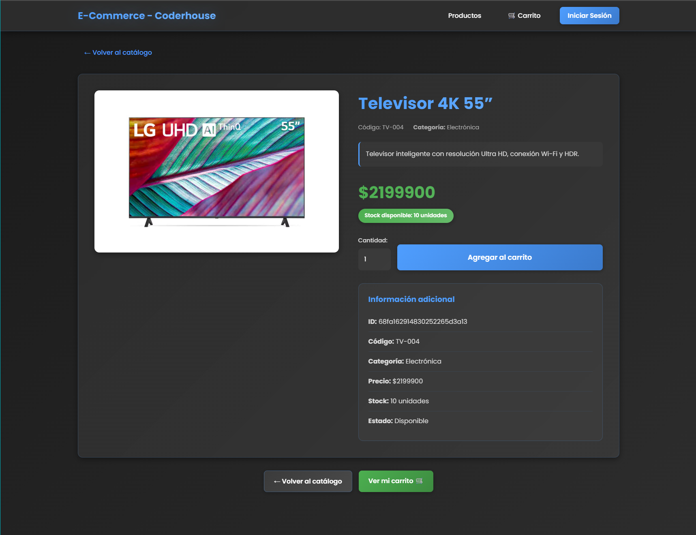
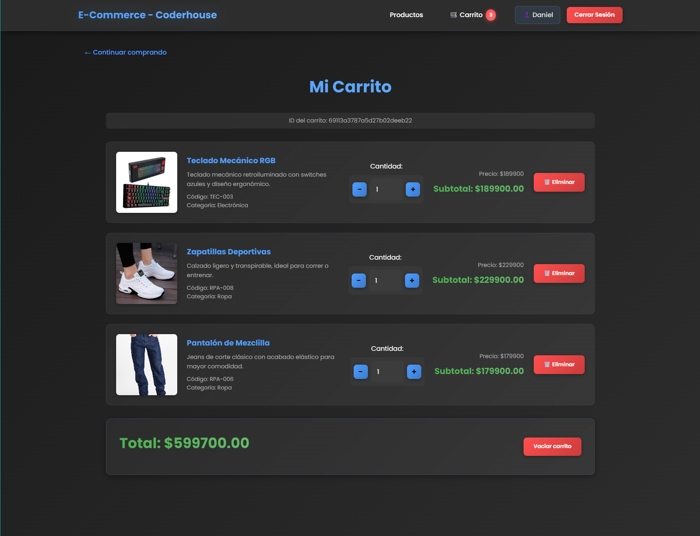
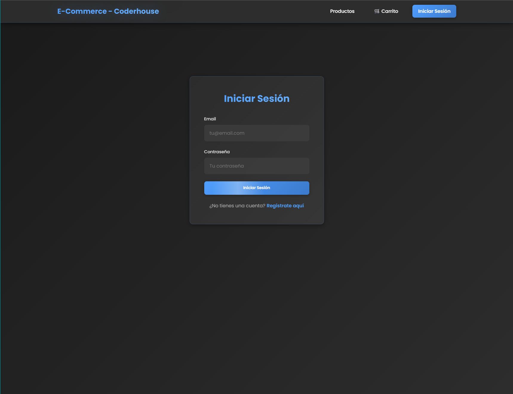
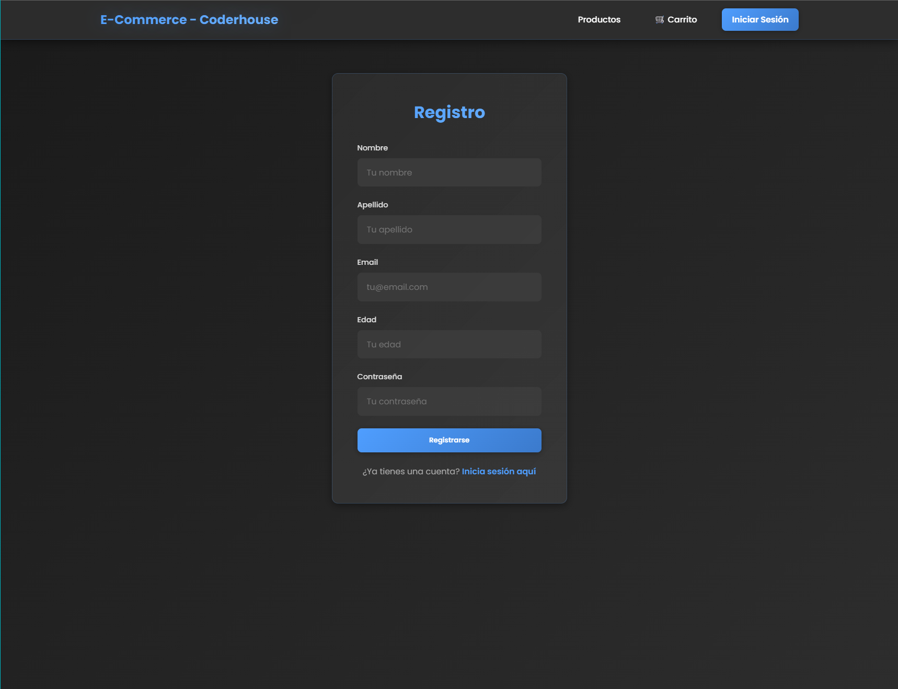
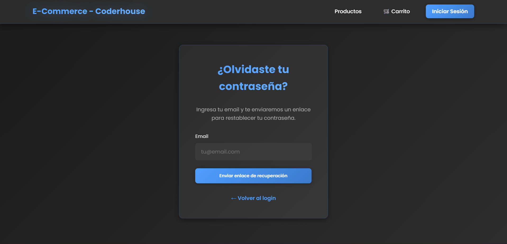

# 

## Coderhouse - Comision 77260

### Tecnologías utilizadas

---

## Entrega #1 (10-11-2025)

### Consigna

Implementar en el proyecto ecommerce facilitado al inicio del curso un CRUD de usuarios, junto con un sistema de Autenticación y Autorización.

## Aspectos a incluir:

### 1. Modelo de Usuario:

Crear un modelo User que contenga los siguientes campos:

- first_name: `String`
- last_name: `String`
- email: `String` (debe ser único)
- age: `Number`
- password: `String` (en formato hash)
- cart: `Id` con referencia a Carts
- role: `String` (valor por defecto: `user`)

### 2. Encriptacion de Contraseña:

Utilizar el paquete bcrypt para encriptar la contraseña del usuario mediante el método hashSync.

### 3. Estrategias de Passport:

Desarrollar las estrategias de Passport para que funcionen con el modelo de usuarios creado.

### 4. Sistema de Login:

Implementar un sistema de login del usuario que trabaje con JWT (JSON Web Tokens).

### 5. Ruta de Validación:

Agregar al router `/api/sessions/` la ruta `/current`, que validará al usuario logueado y devolverá en una respuesta sus datos asociados al JWT.

## Formato de Entrega:

Link al repositorio de GitHub con el proyecto completo, sin incluir la carpeta node_modules.

Esta actividad es una parte fundamental de la preparación para la entrega del proyecto final y se centra en la implementación de mecanismos de seguridad y gestión de usuarios, que son esenciales para el desarrollo de aplicaciones backend robustas y seguras.

## Entrega Final (30-11-2025)

### Consigna:
Mejorar la arquitectura del servidor desarrollado durante el curso, enfocándose en la implementación de patrones de diseño, manejo de roles y autorización, así como en la mejora de la lógica de negocio del ecommerce.

## Aspectos a Incluir:

### Patrón Repository: 
Implementar el patrón Repository para trabajar con el DAO (Data Access Object) dentro de la lógica de negocio.

### Modificación de la Ruta /current: 
Evitar enviar información sensible del usuario. Enviar un DTO (Data Transfer Object) que contenga solo la información necesaria y no sensible.

### Sistema de Recuperación de Contraseña: 
Implementar un sistema de recuperación de contraseña que envíe un correo con un botón para restablecer la contraseña:

- El enlace del correo debe expirar después de una hora de ser enviado.

- Evitar que el usuario pueda restablecer la contraseña a la misma que tenía anteriormente.

### Middleware de Autorización: 

Crear un middleware que trabaje junto con la estrategia “current” para limitar el acceso a ciertos endpoints:

- Solo el administrador puede crear, actualizar y eliminar productos.

- Solo el usuario puede agregar productos a su carrito.

### Arquitectura Profesional: 
Aplicar una arquitectura más profesional en el servidor, utilizando patrones de diseño, manejo de variables de entorno y técnicas avanzadas como mailing.

### Mejora en la Lógica de Compra: 
Profundizar en los roles de los usuarios y las autorizaciones aplicables a cada rol en el contexto de las compras dentro del ecommerce.

---

**Esta entrega final busca consolidar todos los conocimientos adquiridos durante el curso, enfocándose en la mejora de la arquitectura, seguridad y profesionalización del servidor, preparándote para desarrollar aplicaciones backend robustas y bien estructuradas.**

---

## Criterios:

### Implementación de DAO y DTO en Capa de Persistencia:

Los DAOs y DTOs están adecuadamente estructurados y separados, siguiendo buenas prácticas de diseño y arquitectura. La transferencia de datos entre capas es eficiente y se minimiza el uso de consultas redundantes a la base de datos.

### Patrón Repository y Lógica de Negocio:

El patrón Repository se aplica de manera ejemplar, separando claramente la lógica de acceso a datos de la lógica de negocio. Las operaciones de negocio se realizan de manera eficiente y coherente utilizando los Repository.

### Middleware de Autorización y Seguridad de Endpoints:

El middleware de autorización se integra perfectamente con la estrategia "current", permitiendo delimitar el acceso a los endpoints según los roles de usuario de manera segura y eficiente.

### Modelo de Ticket y Lógica de Compra:

El modelo Ticket se crea correctamente con todos los campos necesarios y se implementa una lógica de compra robusta que verifica el stock de los productos, genera tickets y maneja compras completas e incompletas de manera eficiente.
| `home.handlebars` | `productDetail.handlebars` |
| :---------------: | :------------------------: |
|  |  |

| `cart.handlebars` | `login.handlebars` |
| :---------------: | :----------------: |
|  |  |

| `register.handlebars` | `forgotPassword.handlebars` |
| :-------------------: | :-------------------------: |
|  |  |
